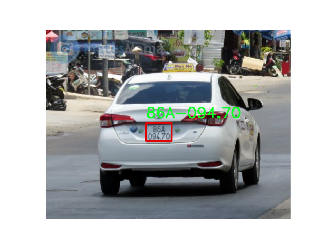
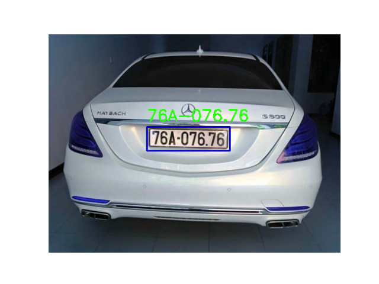
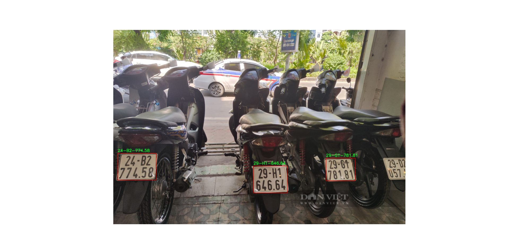

# Vietnamese License Plate Recognition

This project implements an end-to-end **Vietnamese License Plate Recognition (VLPR)** system using **YOLOv11** for license plate detection and **PaddleOCR** for text recognition.

The system supports both common Vietnamese license plate formats:
- Single-line plates
- Two-line plates

## Model Fine-tuning

The YOLOv11 detection model was fine-tuned on a Vietnamese license plate dataset to improve localization accuracy under real-world conditions.

### Dataset:
[License Plate Detection Dataset](https://drive.google.com/file/d/1xchPXf7a1r466ngow_W_9bittRqQEf_T/view)

## Results

Below are example results:

  

## Notes
This project is developed for learning and research purposes only.